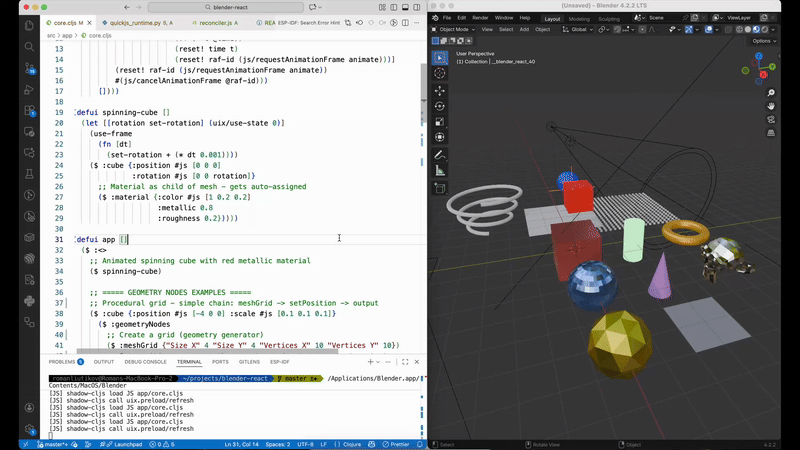

# Blender React

A Blender addon that lets you create and manage 3D scenes using React components. It embeds QuickJS (a lightweight JavaScript engine) into Blender and provides a custom React reconciler that maps React components to Blender objects.



## Features

- **Declarative 3D scenes** - Define Blender scenes using React/JSX syntax
- **Full React support** - Hooks, state, effects, and component composition all work
- **Parent-child relationships** - Nested components create proper Blender object hierarchies
- **Materials** - PBR materials with color, metallic, roughness, emission, transparency
- **Geometry Nodes** - Procedural geometry via Blender's node system, exposed as React components
- **Animations** - `requestAnimationFrame` and `setInterval` for real-time animations
- **Live reloading** - Reload your scene without restarting Blender
- **ClojureScript + UIx** - Built with ClojureScript and shadow-cljs for a great developer experience

## Installation

### Prerequisites

- Blender 3.0+
- Node.js 18+
- Java (for ClojureScript/shadow-cljs)

### Setup

1. Clone this repository into your Blender addons folder or symlink it:

   ```bash
   cd ~/.config/blender/4.0/scripts/addons  # Linux
   cd ~/Library/Application\ Support/Blender/4.0/scripts/addons  # macOS
   ln -s /path/to/blender-react .
   ```

2. Install dependencies:

   ```bash
   npm install
   ```

3. Build the JavaScript bundle:

   ```bash
   # First compile ClojureScript
   npx shadow-cljs compile app

   # Then bundle for QuickJS
   npm run build
   ```

4. Enable the addon in Blender:
   - Go to Edit → Preferences → Add-ons
   - Search for "Blender React"
   - Enable it

## Usage

### Basic Example

```clojure
(ns app.core
  (:require [uix.core :as uix :refer [$ defui]]
            [blender.client :as bc]))

(defui app []
  ($ :<>
    ($ :cube {:position #js [0 0 0]})
    ($ :sphere {:position #js [3 0 0]})
    ($ :camera {:position #js [10 -10 8] :rotation #js [1.0 0 0.8]})))

(defn init []
  (bc/render #'app))
```

### Supported Components

#### Mesh Primitives

| Component        | Props                                                          |
| ---------------- | -------------------------------------------------------------- |
| `:cube` / `:box` | `position`, `rotation`, `scale`                                |
| `:sphere`        | `position`, `rotation`, `scale`, `segments`, `rings`           |
| `:icosphere`     | `position`, `rotation`, `scale`, `subdivisions`                |
| `:cylinder`      | `position`, `rotation`, `scale`, `radius`, `depth`, `vertices` |
| `:cone`          | `position`, `rotation`, `scale`, `radius`, `depth`, `vertices` |
| `:torus`         | `position`, `rotation`, `radius`, `minor-radius`               |
| `:plane`         | `position`, `rotation`, `scale`                                |
| `:circle`        | `position`, `rotation`, `radius`, `vertices`                   |
| `:grid`          | `position`, `rotation`, `x-subdivisions`, `y-subdivisions`     |
| `:monkey`        | `position`, `rotation`, `scale` (Suzanne!)                     |

#### Lights

| Component                | Props                                     |
| ------------------------ | ----------------------------------------- |
| `:light` / `:pointLight` | `position`, `rotation`, `energy`, `color` |
| `:sunLight`              | `position`, `rotation`, `energy`, `color` |
| `:spotLight`             | `position`, `rotation`, `energy`, `color` |
| `:areaLight`             | `position`, `rotation`, `energy`, `color` |

#### Camera

| Component | Props                                                                  |
| --------- | ---------------------------------------------------------------------- |
| `:camera` | `position`, `rotation`, `camera-type` (`"PERSP"`, `"ORTHO"`, `"PANO"`) |

#### Materials

Materials are added as children of mesh objects and automatically get assigned:

| Component   | Props                                                                                        |
| ----------- | -------------------------------------------------------------------------------------------- |
| `:material` | `color`, `metallic`, `roughness`, `emission`, `emissionStrength`, `alpha`, `ior`, `specular` |

**Material Props:**

- `color` - `#js [r g b]` - Base color (0-1 range)
- `metallic` - `0.0` to `1.0` - Metallic factor (0 = dielectric, 1 = metal)
- `roughness` - `0.0` to `1.0` - Surface roughness (0 = mirror, 1 = matte)
- `emission` - `#js [r g b]` - Emission color
- `emissionStrength` - Emission intensity multiplier
- `alpha` - `0.0` to `1.0` - Transparency (0 = invisible, 1 = opaque)
- `ior` - Index of refraction (e.g., 1.45 for glass)
- `specular` - Specular reflection intensity

**Example:**

```clojure
;; Red metallic cube
($ :cube {:position #js [0 0 0]}
  ($ :material {:color #js [1 0.2 0.2]
                :metallic 0.8
                :roughness 0.2}))

;; Glowing green sphere
($ :sphere {:position #js [3 0 0]}
  ($ :material {:color #js [0.1 0.1 0.1]
                :emission #js [0 1 0]
                :emissionStrength 5.0}))

;; Semi-transparent glass
($ :plane {:position #js [0 0 1]}
  ($ :material {:color #js [0.9 0.9 1.0]
                :alpha 0.3
                :roughness 0.0
                :ior 1.45}))
```

#### Empty (Grouping)

| Component           | Props                                         |
| ------------------- | --------------------------------------------- |
| `:empty` / `:group` | `position`, `rotation`, `scale`, `empty-type` |

#### Geometry Nodes

Geometry Nodes allow you to create procedural geometry using Blender's node-based system, exposed as React components:

```clojure
;; Simple chain: meshGrid -> setPosition -> output (auto-connected)
($ :cube {:position #js [0 0 0] :scale #js [0.1 0.1 0.1]}
  ($ :geometryNodes
    ($ :meshGrid {"Size X" 4 "Size Y" 4 "Vertices X" 20 "Vertices Y" 20})
    ($ :setPosition {})))

;; Node-as-prop: pass nodes directly as socket inputs!
($ :plane {:position #js [0 0 0]}
  ($ :geometryNodes
    ($ :meshGrid {"Size X" 5 "Size Y" 5})
    ;; meshCube is passed as the "Instance" socket input
    ($ :instanceOnPoints {:Instance ($ :meshCube {:Size #js [0.1 0.1 0.1]})})))

;; Spiral tube with profile curve as prop
($ :cube {:position #js [0 0 0]}
  ($ :geometryNodes
    ($ :curveSpiral {:Rotations 3 :Height 2.0})
    ;; curveCircle is passed as the "Profile Curve" socket input
    ($ :curveToMesh {"Profile Curve" ($ :curveCircle {:Radius 0.1})})))
```

**Connection Methods:**

1. **Auto-chaining** (default): Geometry processors automatically connect in sequence
2. **Node-as-prop** (recommended): Pass nodes as props to connect to specific sockets
   ```clojure
   ($ :instanceOnPoints {:Instance ($ :meshCube {})})
   ```
3. **Explicit connect** (escape hatch): For complex cases
   ```clojure
   ($ :meshCube {:connect {:node "instanceOnPoints" :socket "Instance"}})
   ```

**Available Geometry Nodes:**

| Category             | Nodes                                                                                                                                                                                                        |
| -------------------- | ------------------------------------------------------------------------------------------------------------------------------------------------------------------------------------------------------------ |
| **Mesh Primitives**  | `:meshCube`, `:meshCylinder`, `:meshCone`, `:meshSphere`, `:meshIcosphere`, `:meshGrid`, `:meshCircle`, `:meshLine`                                                                                          |
| **Curve Primitives** | `:curveLine`, `:curveCircle`, `:curveStar`, `:curveSpiral`, `:curveQuadrilateral`, `:curveBezier`                                                                                                            |
| **Geometry Ops**     | `:transform`, `:join`, `:setPosition`, `:setShade`, `:subdivide`, `:subdivideSurf`, `:extrude`, `:bevel`, `:triangulate`, `:flip`, `:merge`, `:boolean`, `:convexHull`, `:duplicate`, `:delete`, `:separate` |
| **Curve Ops**        | `:curveToMesh`, `:curveToPoints`, `:meshToCurve`, `:fillCurve`, `:fillet`, `:resample`, `:reverse`, `:trim`, `:setSplineType`                                                                                |
| **Instances**        | `:instanceOnPoints`, `:realizeInstances`, `:rotateInstances`, `:scaleInstances`, `:translateInstances`                                                                                                       |
| **Input**            | `:position`, `:normal`, `:index`, `:id`, `:objectInfo`, `:collectionInfo`, `:value`, `:vector`, `:integer`, `:boolean`, `:color`                                                                             |
| **Math**             | `:math`, `:vectorMath`, `:compare`, `:clamp`, `:mapRange`, `:mix`, `:floatToInt`, `:noise`, `:voronoi`, `:gradient`, `:wave`, `:musgrave`                                                                    |
| **Utilities**        | `:switch`, `:random`, `:combineXYZ`, `:separateXYZ`, `:alignRotationToVector`, `:rotateVector`                                                                                                               |
| **Attribute**        | `:storeNameAttr`, `:namedAttr`, `:captureAttr`                                                                                                                                                               |
| **Material**         | `:setMaterial`, `:materialIndex`, `:setMaterialIndex`                                                                                                                                                        |

**Node Props:**

Each geometry node accepts Blender's socket names as props. Use the exact names from Blender's node editor (e.g., `"Size X"`, `"Vertices Y"`, `:Radius`, etc.). Use string keys for names with spaces.

### Common Props

All components support these transform props:

- `position` - `#js [x y z]` - World or local position
- `rotation` - `#js [x y z]` - Euler rotation in radians
- `scale` - `#js [x y z]` - Scale factor

### Parent-Child Relationships

Nested components create parent-child relationships in Blender:

```clojure
($ :empty {:position #js [0 0 3]}
  ;; These are children of the empty, positioned relative to it
  ($ :cube {:position #js [1 0 0]})    ; 1 unit to the right of parent
  ($ :sphere {:position #js [-1 0 0]})) ; 1 unit to the left of parent
```

Moving the parent will move all children with it.

### Animation with requestAnimationFrame

Use `requestAnimationFrame` for smooth animations:

```clojure
(defui spinning-cube []
  (let [[rotation set-rotation] (uix/use-state 0)]
    (uix/use-effect
      (fn []
        (let [raf-id (atom nil)
              animate (fn animate []
                        (set-rotation #(+ % 0.02))
                        (reset! raf-id (js/requestAnimationFrame animate)))]
          (reset! raf-id (js/requestAnimationFrame animate))
          #(js/cancelAnimationFrame @raf-id)))
      [])
    ($ :cube {:position #js [0 0 0]
              :rotation #js [0 0 rotation]})))
```

### Using React Hooks

Full React hooks support:

```clojure
(defui counter-cube []
  (let [[count set-count] (uix/use-state 0)]
    (uix/use-effect
      (fn []
        (let [interval (js/setInterval #(set-count inc) 1000)]
          #(js/clearInterval interval)))
      [])
    ($ :cube {:position #js [0 0 count]
              :scale #js [1 1 (+ 1 (* count 0.1))]})))
```

## Development

### Project Structure

```
blender-react/
├── src/
│   ├── app/
│   │   └── core.cljs        # Main app entry point
│   └── reconciler.js        # React reconciler for Blender
├── quickjs_runtime.py       # Python/Blender bridge to QuickJS
├── __init__.py              # Blender addon entry point
├── bundle.js                # Built JavaScript bundle
├── shadow-cljs.edn          # ClojureScript build config
└── package.json
```

### Development Workflow

1. Start shadow-cljs watch (for ClojureScript hot-reload):

   ```bash
   npx shadow-cljs watch app
   ```

2. In another terminal, bundle for QuickJS:

   ```bash
   npm run build
   ```

3. In Blender, press `F3` and search for "Reload QuickJS Plugin" to reload changes.

### Debugging

Start Blender from the terminal to see console output:

```bash
# macOS
/Applications/Blender.app/Contents/MacOS/Blender

# Linux
blender
```

Use `print()` in JavaScript or `console.log()` to debug:

```clojure
(js/print "Debug:" some-value)
(js/console.log "Hello from JS")
```

## Architecture

```
┌─────────────────────────────────────────────────────────────┐
│                        Blender                              │
│  ┌─────────────────────────────────────────────────────┐   │
│  │                  Python Addon                        │   │
│  │  ┌─────────────────────────────────────────────┐    │   │
│  │  │              QuickJS Runtime                 │    │   │
│  │  │  ┌─────────────────────────────────────┐    │    │   │
│  │  │  │        React + Reconciler            │    │    │   │
│  │  │  │  ┌─────────────────────────────┐    │    │    │   │
│  │  │  │  │   ClojureScript + UIx       │    │    │    │   │
│  │  │  │  │   (Your App Code)           │    │    │    │   │
│  │  │  │  └─────────────────────────────┘    │    │    │   │
│  │  │  └─────────────────────────────────────┘    │    │   │
│  │  └─────────────────────────────────────────────┘    │   │
│  └─────────────────────────────────────────────────────┘   │
│                              ↓                              │
│                    bpy.ops / bpy.data                       │
│                      (Blender API)                          │
└─────────────────────────────────────────────────────────────┘
```

## License

ISC
